# Examens met ans

## Casus

Examen Linux voor ops / data engineers

- Digitaal examen
- Individuele examenopgaven
- Alle leerstof komt aan bod in een opgave

## Inhoud

- Ans activeren
- Leerdoelen opstellen
- Itembank aanmaken
    - Focus op open vragen
- Opgave voorbereiden
    - Toetsmatrijs
    - Genereren
- Examen afnemen

# Voorbereiding

## Ans activeren

- Ga naar Chamilo-cursus
- Onzichtbaar voor studenten
- Evt. Ans zichtbaar maken
- Activeer

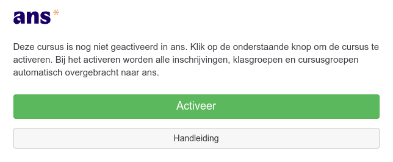

## Leerdoelen opstellen

- Na activatie kan je doorklikken naar Ans (of <https://ans.app/>)
- Maak eerst een itembank aan voor het vak

    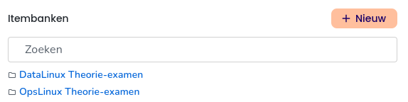

## Leerdoelen opstellen

- Ga naar Leerdoelen

    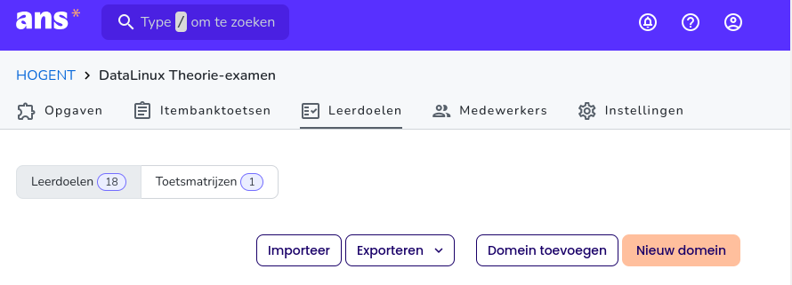

## Leerdoelen opstellen

- TOPTOC Leerresultaten $\rightarrow$ Ans leerdoelen
    - Leerdoelen studiefiche $\Rightarrow$ domeinen
    - Topics onder leerdoel $\Rightarrow$ leerdoel
- Goede voorbereiding is belangrijk
    - [Voorbeeld voorbereiding](https://hogent.sharepoint.com/:x:/r/sites/DepartementDIT/Gedeelde%20documenten/11%20Leerlijn%20Install,%20maintain%20and%20secure/Linux/linux-leerresultaten-leerdoelen-ans.xlsx?d=w2a0bb916244642839d7db7cb1076f9dc&csf=1&web=1&e=LnVbaD)

## Leerdoelen opstellen

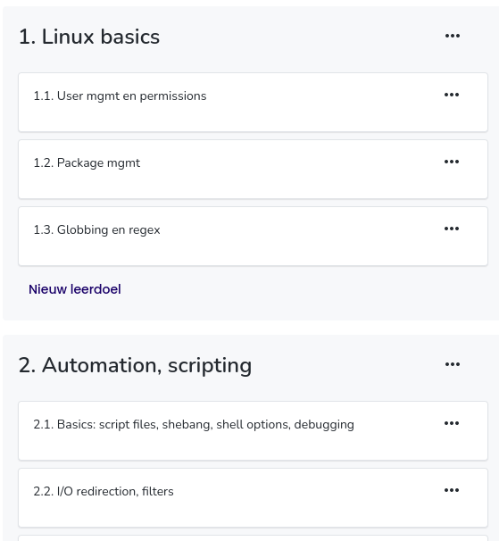

# Itembanken

## Voorbeelden van open vragen

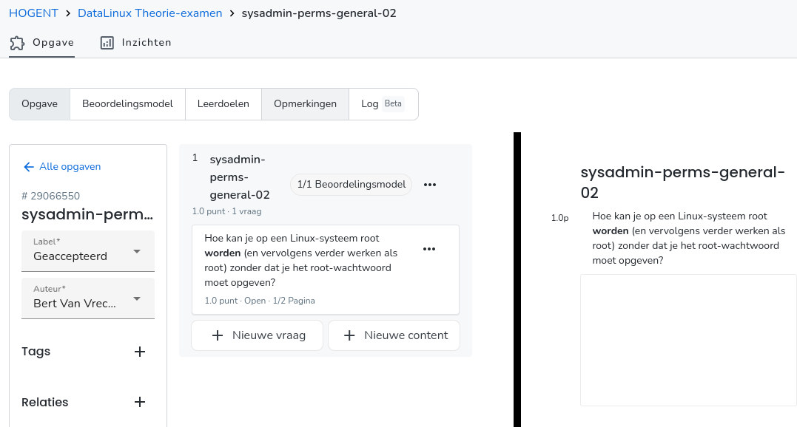

## Tips bij opstellen

- Naamconventie (bv. `domein-topic-nn`)
- Koppel elke vraag aan leerdoel
- Gebruik labels om te communiceren met collega's
    - Concept > Beoordeling nodig > Wijziging nodig > Geaccepteerd
- Relaties
    - Verwant: stel beide vragen in een toets
    - Vijand: stel nooit beide vragen tegelijk

## Beoordelingsmodel

- Goed beoordelingsmodel $\Rightarrow$ efficiënt verbeteren!

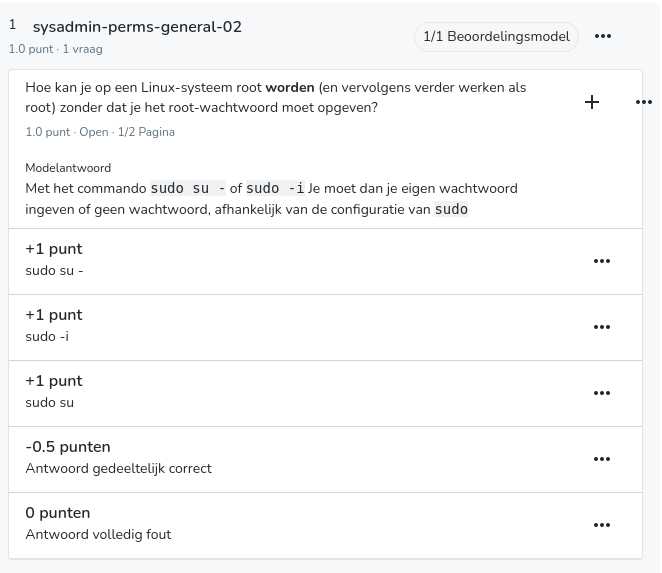

## Vragen met Python

Meer bepaald: open vraag waarvan de opgave + modeloplossing (deels) gegenereerd werd door Python.

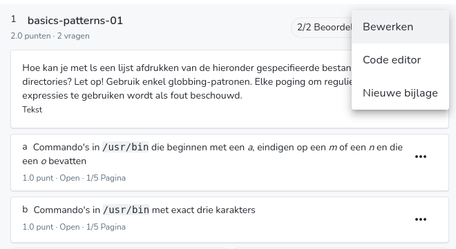

## Python-code

```python
vragen = [
    ('die beginnen met een <i>a</i> en eindigen op een <i>n</i>',
     '/usr/bin/a*n'),
    ('die beginnen met een <i>a</i>, eindigen op een <i>m</i> of een <i>n</i> en die een <i>o</i> bevatten',
     '/usr/bin/a*o*[mn]'),
    ('waarvan de tweede letter een <i>a</i> is',
     '/usr/bin/?a*'),
    ('waarvan de tweede letter een <i>a</i> is en die eindigen op een <i>n</i>',
     '/usr/bin/?a*n'),
    ('met exact drie karakters',
     '/usr/bin/???'),
    ('die eindigen op een oneven cijfer',
     '/usr/bin/*[13579]'),
    ('waarvan het tweede teken geen kleine letter is',
     '/usr/bin/?[^a-z]*')
]
```

## Python code (vervolg)

```python
# Selecteer 2 verschillende vragen
selectie1 = random(0, len(vragen)-1)
selectie2 = (selectie1 + random(1, len(vragen)-2)) % len(vragen)

# Elke variabele kan je in een vraag gebruiken
vraag_a = vragen[selectie1][0]
antwoord_a = vragen[selectie1][1]

vraag_b = vragen[selectie2][0]
antwoord_b = vragen[selectie2][1]

# Printf ter info (test, controle)
print(f"a) Commando's in /usr/bin {vraag_a}.")
print(f'   Antwoord: {antwoord_a}')

print(f"b) Commando's in /usr/bin {vraag_b}.")
print(f'   Antwoord: {antwoord_b}')
```

## Python vragen

- De waarde van elke variabele kan je in een vraag gebruiken:

    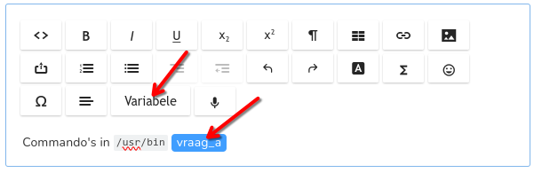

- Idem voor modelantwoord:

    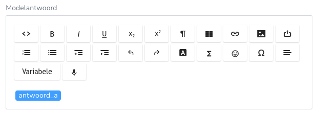

# Examen opstellen

## Toetsmatrijs

- = "recept" om toets met willekeurige vragen te genereren
- Doe dit pas als je voldoende vragen hebt voor een examen!

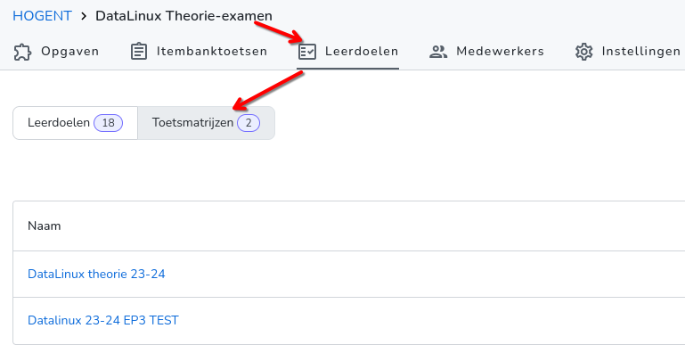

## Toetsmatrijs

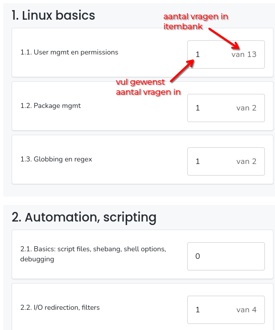

## Itembanktoets aanmaken met toetsmatrijs

Zie ook deze demo: <https://www.youtube.com/watch?v=QlfRhk2IwGU&t=22s>

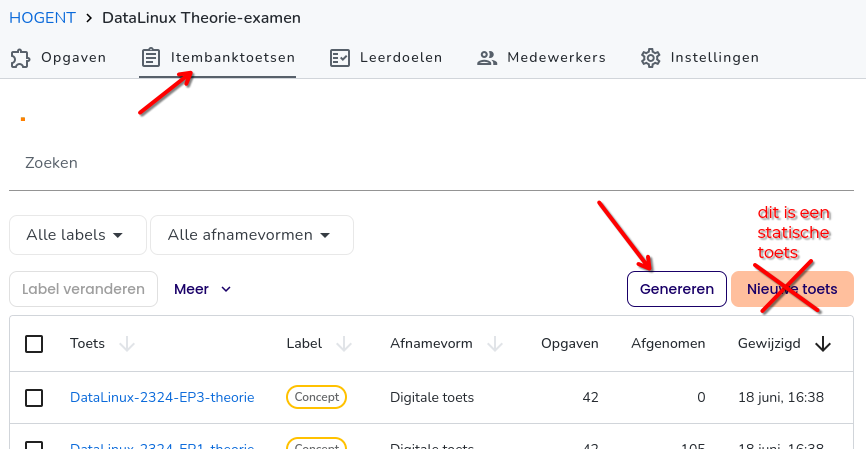

## Itembanktoets instellingen

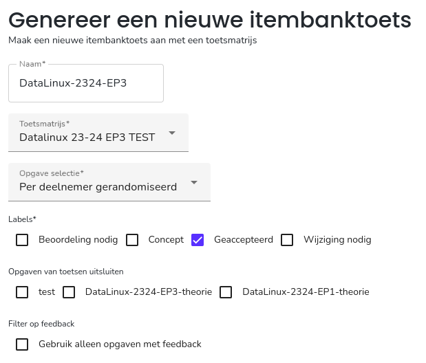

## Itembanktoets controle

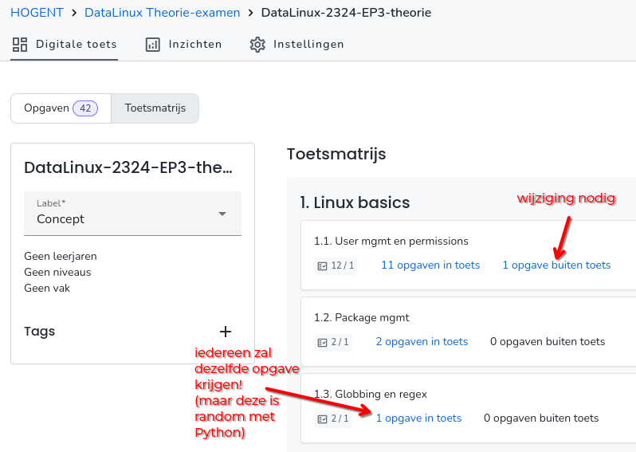

## Kopiëren naar vak

Doe dit pas als de toets klaar is! Wijzigingen in vragen komen niet meteen in de toets!

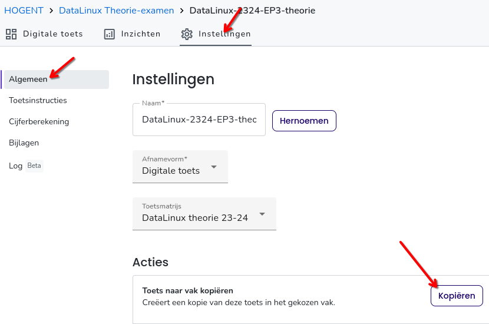

# Examen afnemen

## Voorbereiding

- Maak eerst cursusgroepen aan in Chamilo!
    - Regulier: geen aparte groep nodig
    - Extra tijd (IOEM): voeg enkel studenten met extra tijd toe
    - Inhaalexamen
- Volgorde plannen:
    - Plan eerst de reguliere afname, voeg alle studenten toe
    - Daarna IOEM
    - Studenten krijgen enkel laatst geregistreerde afname te zien

## Afname aanmaken

- Ga naar Vak, selecteer toets
- Ga naar Afname > Nieuw
    - Selecteer groep (eerst Alle studenten)
    - Selecteer dag, begin- en einduur

---

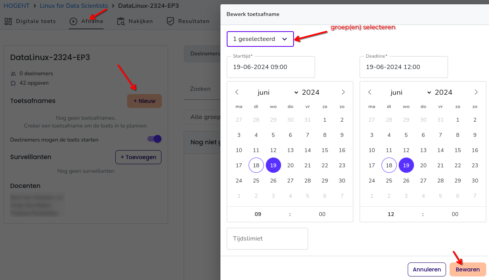

## Toetsinstellingen

- Toegankelijkheid
    - Aantal pogingen beperken
    - Wachtwoord
- Hulpmiddelen, bv. kladblok, chat, rekenmachine
- Verlaten tabblad/knippen en plakken rapporteren
- Navigatie beperken (af te raden!)

## Nakijkinstellingen

- Nakijkinstellingen
    - Anoniem nakijken
    - Identieke antwoorden gelijk beoordelen
- Nakijkers toewijzen
    - Per vraag of per groep!
    - Of gewoon iedereen kan alles...

## Nog meer instellingen!

- Cijferberekening aanpassen (normaal behaald/max $\times$ 20)
- Elektronische feedback (toetsinzage)
    - Niveau van inzage instellen

## Layout bewerken

**Belangrijk!**

- Tabblad Digitale toets, rechts bovenaan: **Layout bewerken**
- Opmaak aanpassen
- Titels van opgaven weergeven **uitvinken**

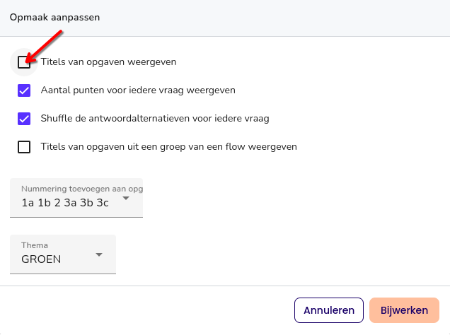

## Eindcontrole

- Rechtsonder: "Toets bekijken"

## Examenafname opvolgen

- Ga naar Vak > Toets > Afname
- 3 kolommen:
    - Nog niet gestart
    - Bezig
    - Ingeleverd
- Je kan indien nodig nog aanpassingen maken
    - Deelnemers beheren
    - Van Bezig naar Ingeleverd verplaatsen
    - Van Ingeleverd naar Bezig verplaatsen

# Na het examen

## Verbeteren

- Kan per vraag of student
- Gesloten vragen: automatisch
- Open vragen: ahv beoordelingsmodel
    - Sneltoetsen: keypad (score) + Enter (next)
    - Opmerkingen mogelijk
- Aanpassingen mogelijk!
    - Vlaggen - signaleer problematische vraag

**Mijn ervaring: nog 20% van de tijd nodig voor verbeteren t.o.v. papieren examen!**

---

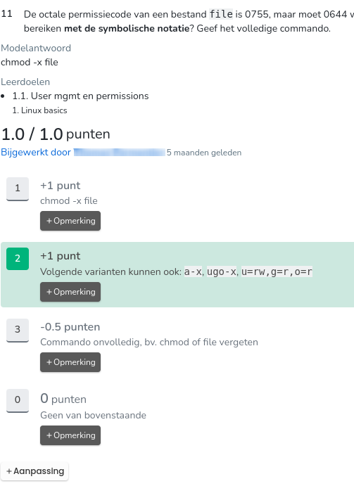

## Resultaten exporteren

- Je kan vragen niet laten meetellen
    - (sorry, ik weet niet meer hoe 🙈)
- CSV exporteren (zie vb [DataLinux, tabblad Theorie](https://hogent.sharepoint.com/:x:/r/sites/DepartementDIT/Gedeelde%20documenten/11%20Leerlijn%20Install,%20maintain%20and%20secure/Linux/23-24/datalinux-2324-puntenlijst.xlsx?d=wa9f4044bc82947caa870d9ebf9018730&csf=1&web=1&e=Jw0uOV))
    - ID: Studentnummer, email
    - Cijfer: herrekend op 20 (of jouw formule)
    - Punten: totaal punten behaald op toets
    - Maximale punten: kan verschillen door random vragen!

## Inzichten

- Veel mogelijkheden om resultaten te bestuderen!
- Per vraag: kwaliteit vragen, moeilijkheidsgraad
- Per leerdoel

## Elektronische feedback geven

Veel mogelijk, nog niet geprobeerd 😉

## That's it!

Demo/vragen op een rustiger moment? Laat iets weten!
