# Elektronsiche examens met ans

## Even voorstellen

- Bert Van Vreckem
- Lector Informatica, dept IT & Digitale Innovatie
- Sinds 2002 aan HOGENT

Slides:

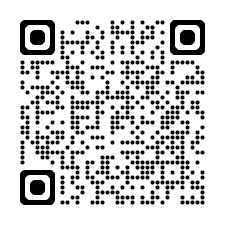

## Casus

- Opleiding *PBA toegepaste informatica*
- Olod *Linux voor system / data engineers*
- Vroegere examenvorm: op papier!

**Wensen:**

- Digitaal examen
- Gesloten en open vragen
- Individuele examenopgaven met willekeurige vragen
- In elke opgave komt alle leerstof aan bod

## Inhoud

- Ans activeren
- Leerdoelen opstellen
- Itembank aanmaken
    - Focus op open vragen
- Opgave voorbereiden
    - Toetsmatrijs
    - Genereren
- Examen afnemen

# Voorbereiding

## Ans activeren

- Ga naar Chamilo-cursus
- Onzichtbaar voor studenten
- Evt. Ans zichtbaar maken
- Activeer

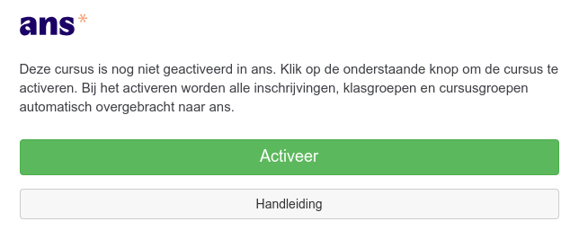

## Leerdoelen opstellen

- Na activatie kan je doorklikken naar Ans (of <https://ans.app/>)
- Maak eerst een itembank aan voor het vak
- Staat los van het vak in Chamilo/Ans!

    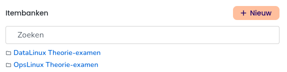

## Leerdoelen opstellen

- Ga naar Leerdoelen

    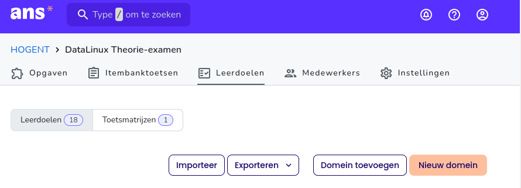

## Leerdoelen opstellen

- TOPTOC Leerresultaten $\rightarrow$ Ans leerdoelen
    - Leerdoelen studiefiche $\Rightarrow$ domeinen
    - Topics onder leerdoel $\Rightarrow$ leerdoel
- Goede voorbereiding is belangrijk

## Voorbereiding

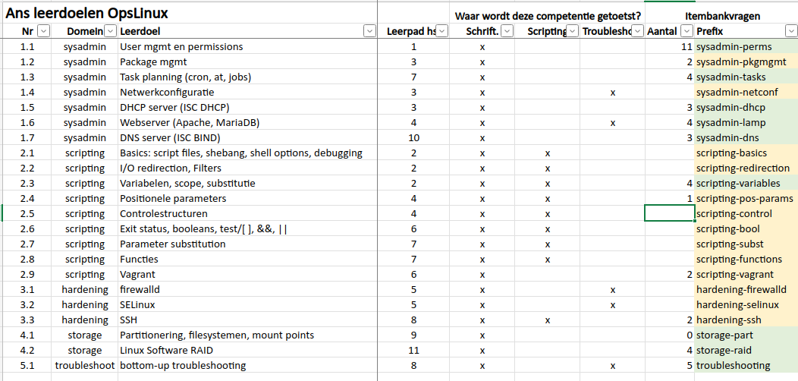

## Leerdoelen opstellen


# Itembanken

## Voorbeelden van open vragen


## Tips bij opstellen

- Naamconventie (bv. `domein-topic-nn`)
- Koppel elke vraag aan leerdoel
- Gebruik labels om te communiceren met collega's
    - Concept > Beoordeling nodig > Wijziging nodig > Geaccepteerd
- Relaties verwant/vijand
    - **Let op!** Deze zijn niet functioneel!

## Leerdoel koppelen

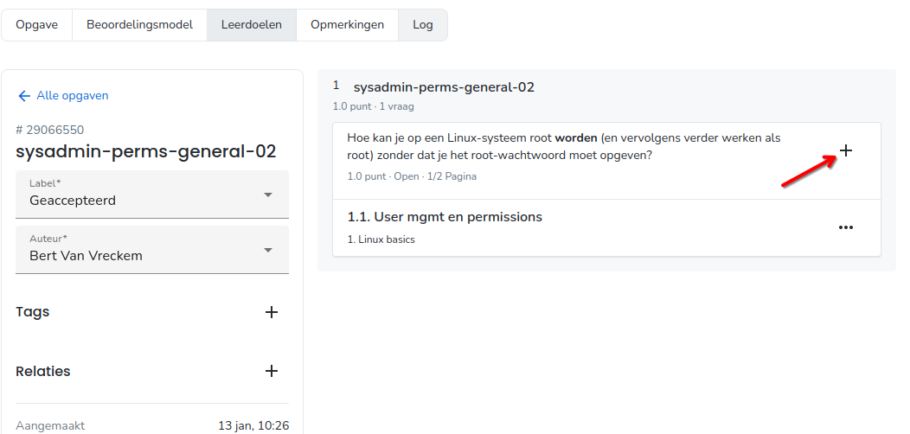

## Beoordelingsmodel

- Goed beoordelingsmodel $\Rightarrow$ efficiënt verbeteren!

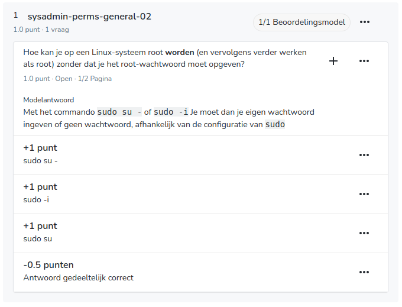

## Vragen met Python

Meer bepaald: open vraag waarvan de opgave + modeloplossing (deels) gegenereerd werd door Python.

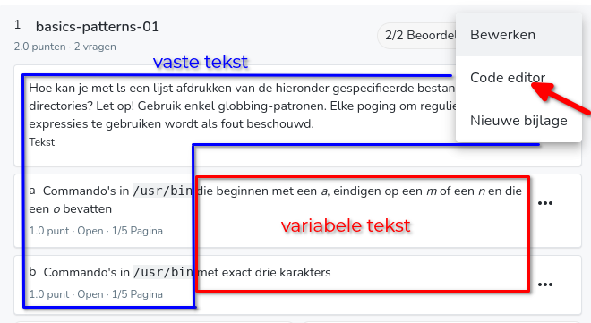

## Python-code

```python
vragen = [
    ('die beginnen met een <i>a</i> en eindigen op een <i>n</i>',
     '/usr/bin/a*n'),
    ('die beginnen met een <i>a</i>, eindigen op een <i>m</i> of een <i>n</i> ...',
     '/usr/bin/a*o*[mn]'),
    ('waarvan de tweede letter een <i>a</i> is',
     '/usr/bin/?a*'),
    ('waarvan de tweede letter een <i>a</i> is en die eindigen op een <i>n</i>',
     '/usr/bin/?a*n'),
    ('met exact drie karakters',
     '/usr/bin/???'),
    ('die eindigen op een oneven cijfer',
     '/usr/bin/*[13579]'),
    ('waarvan het tweede teken geen kleine letter is',
     '/usr/bin/?[^a-z]*')
]
```

## Python code (vervolg)

```python
# Selecteer 2 verschillende vragen
selectie1 = random(0, len(vragen)-1)
selectie2 = (selectie1 + random(1, len(vragen)-2)) % len(vragen)

# Elke variabele kan je in een vraag gebruiken
vraag_a = vragen[selectie1][0]
antwoord_a = vragen[selectie1][1]

vraag_b = vragen[selectie2][0]
antwoord_b = vragen[selectie2][1]

# Printf ter info (test, controle)
print(f"a) Commando's in /usr/bin {vraag_a}.")
print(f'   Antwoord: {antwoord_a}')

print(f"b) Commando's in /usr/bin {vraag_b}.")
print(f'   Antwoord: {antwoord_b}')
```

## Code-editor

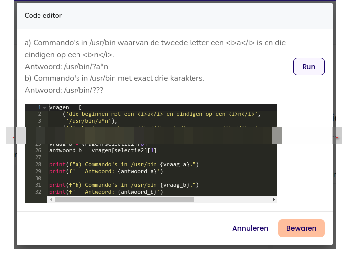

## Python vragen

- De waarde van elke variabele kan je in een vraag gebruiken:

    

- Idem voor modelantwoord:

    

# Examen opstellen

## Toetsmatrijs

- = "recept" om toets met willekeurige vragen te genereren
- Doe dit pas als je voldoende vragen hebt voor een examen!


## Toetsmatrijs

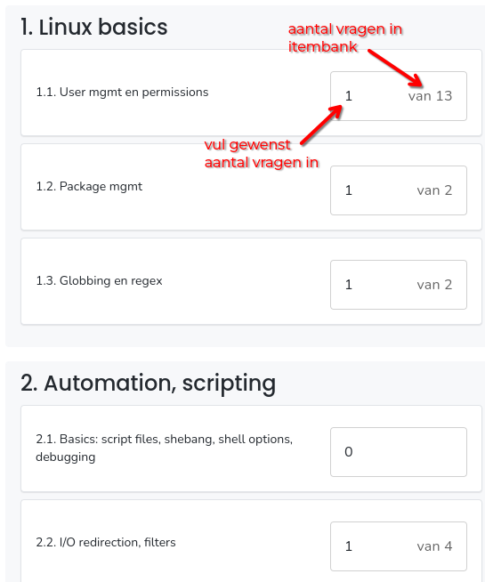

## Itembanktoets aanmaken met toetsmatrijs

Zie ook deze demo: <https://www.youtube.com/watch?v=QlfRhk2IwGU&t=22s>


## Itembanktoets instellingen

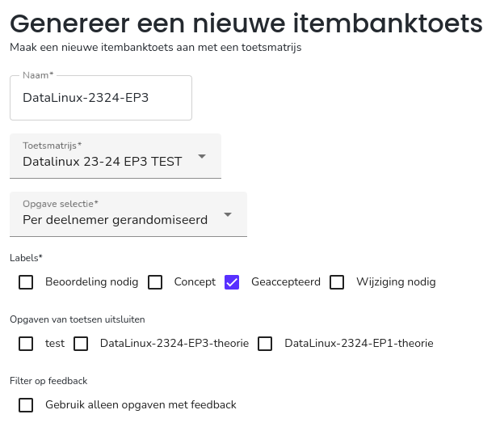

## Itembanktoets instellingen

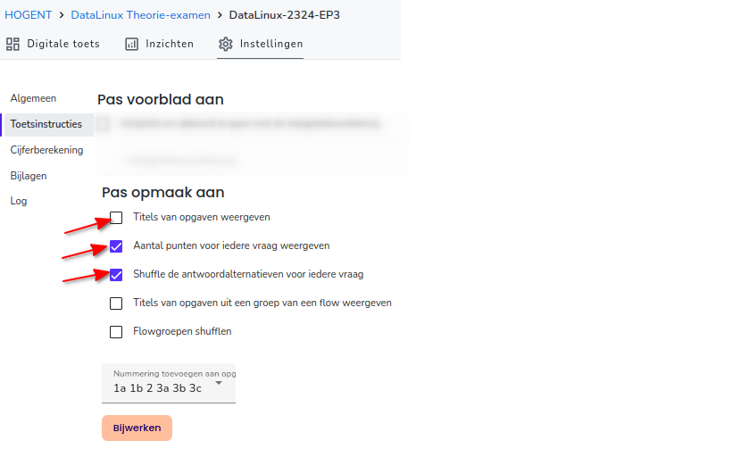

## Itembanktoets controle

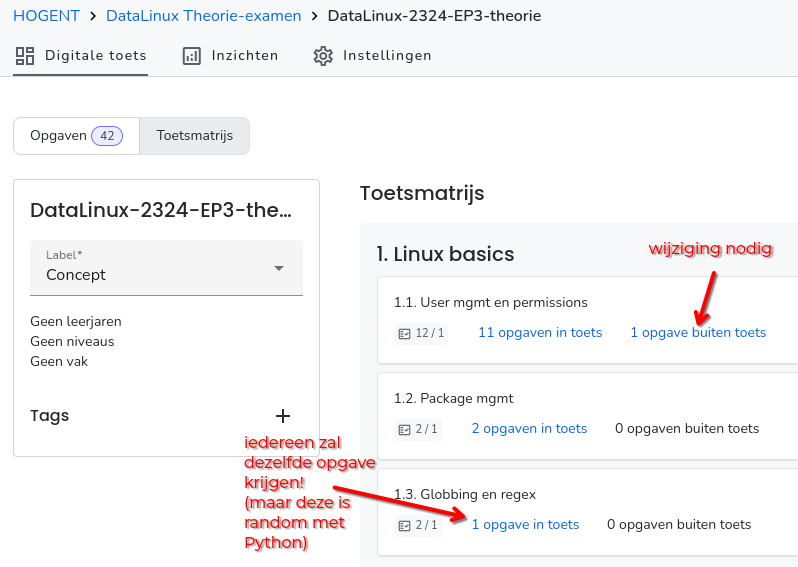

## Kopiëren naar vak

Doe dit pas als de toets klaar is! Wijzigingen in vragen komen niet meteen in de toets!


# Examen afnemen

## Voorbereiding

- Maak eerst cursusgroepen aan in Chamilo!
    - Regulier: geen aparte groep nodig
    - Extra tijd (IOEM): voeg enkel studenten met extra tijd toe
    - Inhaalexamen
- Afname plannen:
    - Plan eerst de reguliere afname, voeg *alle* studenten toe
    - Daarna IOEM
    - Studenten krijgen enkel laatst geregistreerde afname te zien

## Afname aanmaken

- Ga naar Vak, selecteer toets
- Ga naar Afname > Nieuw
    - Selecteer groep (eerst Alle studenten)
    - Selecteer dag, begin- en einduur

---


## Toetsinstellingen

- Toegankelijkheid
    - Aantal pogingen beperken
    - Wachtwoord
- Hulpmiddelen, bv. kladblok, chat, rekenmachine
- Verlaten tabblad/knippen en plakken rapporteren
- Navigatie beperken (af te raden!)

## Nakijkinstellingen

- Nakijkinstellingen
    - Anoniem nakijken
    - Identieke antwoorden gelijk beoordelen
- Nakijkers toewijzen
    - Per vraag of per groep!
    - Of gewoon iedereen kan alles...

## Nog meer instellingen!

- Cijferberekening aanpassen (normaal behaald/max $\times$ 20)
- Elektronische feedback (toetsinzage)
    - Niveau van inzage instellen

## Eindcontrole

- Rechtsonder: "Toets bekijken"


## Examenafname opvolgen

- **Let op!** Laat studenten inloggen op Ans voordat ze hun GSM's wegsteken (2FA)!
- Studenten gaan naar Chamilo-vak > Ans (of rechtstreeks naar <https://ans.app/>)
- Jij gaat in Ans naar Vak > Toets > Afname

## Examenafname opvolgen

Aanpassingen blijven mogelijk!


# Na het examen

## Verbeteren

- Kan per vraag of student
- Gesloten vragen: automatisch
- Open vragen: ahv beoordelingsmodel
    - Sneltoetsen: keypad (score) + Enter (next)
    - Opmerkingen mogelijk
    - Aanpassingen beoordelingsmodel mogelijk!
    - Vlaggen - signaleer problematische vraag

**Mijn ervaring: nog 20% van de tijd nodig voor verbeteren t.o.v. papieren examen!**

---

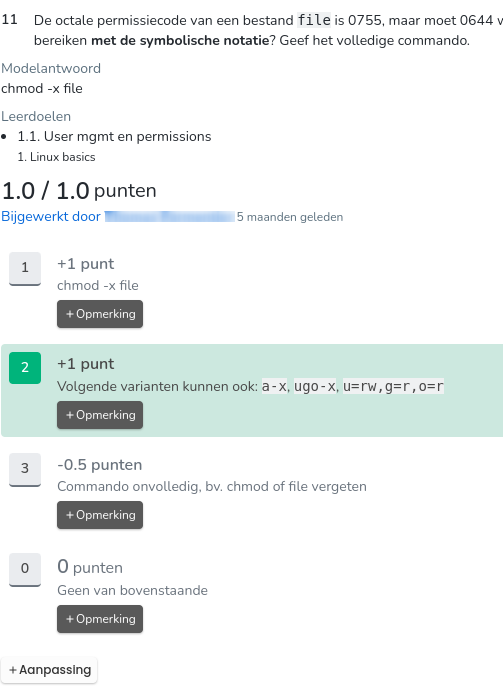

## Resultaten exporteren

- CSV exporteren
    - ID: Studentnummer, email
    - Klas, groep, start- en einduur
    - **Cijfer:** herrekend op 20 (of jouw formule)
    - Punten: totaal punten behaald op toets
    - Maximale punten: kan verschillen door random vragen!
- Je kan vragen niet laten meetellen
    - (sorry, ik weet niet meer hoe 🙈)

## Voorbeeld resultaten


## Inzichten

- Veel mogelijkheden om resultaten te bestuderen!
- Per vraag: kwaliteit vragen, moeilijkheidsgraad
- Per leerdoel

## Elektronische feedback geven

Veel mogelijk, nog niet geprobeerd 😉

# That's it!

## That's it!

Demo/vragen op een rustiger moment? Laat iets weten!

<bert.vanvreckem@hogent.be>

of Ans-kanaal op Teams! 😉

Slides:


